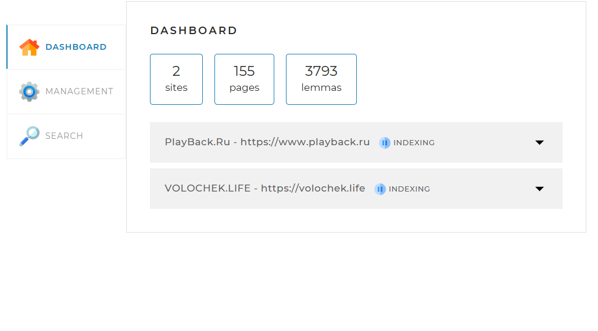

#Локальный поисковый движок по сайту (Search Engine)

Поисковый движок представляет собой Spring-приложение (JAR-файл, запускаемый на любом сервере или компьютере), работающее с локально установленной базой данных MySQL, имеющее простой веб-интерфейс и API, через который им можно управлять и получать результаты поисковой выдачи по запросу. 

#### Стек используемых технологий
- Java 17
- Spring Boot
- MySQL 8 (via Spring Data)
- [Project Lombok](https://projectlombok.org/)
- [Jsoup Parser](https://github.com/jhy/jsoup)
- Logback - logger
- Maven - build tool
- Lucene

### Сборка
```shell
mvn clean install
```
### Запуск приложения
```shell
java -jar SearchEngine-*.jar
```
### Использование приложения
Переход на главную страницу - http://localhost:8080

**Для индексации сайтов, необходимо задать параметры в application.yaml**
```
indexing-settings:
  sites:
    - url: https://www.playback.ru
      name: PlayBack.Ru
    - url: https://volochek.life
      name: VOLOCHEK.LIFE
```

Веб-интерфейс (frontend-составляющая) проекта представляет собой одну веб-страницу с тремя вкладками:

**Dashboard** 


Эта вкладка открывается по умолчанию. На ней отображается общая статистика по всем сайтам, а также детальная статистика и статус по каждому из сайтов (статистика, получаемая по запросу /api/statistics).

**Management** 


На этой вкладке находятся инструменты управления поисковым движком — запуск и остановка полной индексации (переиндексации), а также возможность добавить (обновить) отдельную страницу по ссылке.

**Search** 

Эта страница предназначена для тестирования поискового движка. На ней находится поле поиска, выпадающий список с выбором сайта для поиска, а при нажатии на кнопку «Найти» выводятся результаты поиска (по API-запросу /api/search).
Доступна пагинация.

Вся информация на вкладки подгружается путём запросов к API backend-составляющей. При нажатии кнопок также отправляются запросы.

### Методы API

**Запуск полной индексации — GET /api/startIndexing**

Метод запускает полную индексацию всех сайтов или полную переиндексацию, если они уже проиндексированы.
Если в настоящий момент индексация или переиндексация уже запущена, метод возвращает соответствующее сообщение об ошибке. 

**_Параметры:_**
метод без параметров

Формат ответа в случае успеха:
```json
{
	"result": true
}
```
Формат ответа в случае ошибки:
```json
{
	"result": false,
	"error": "Индексация уже запущена"
}
```

**Остановка текущей индексации — GET /api/stopIndexing**

Метод останавливает текущий процесс индексации (переиндексации). Если в настоящий момент индексация или переиндексация не происходит, метод возвращает соответствующее сообщение об ошибке. 

**_Параметры:_**
метод без параметров.

Формат ответа в случае успеха:

```json
{
	"result": true
}
```

Формат ответа в случае ошибки:
```json
{
	"result": false,
	"error": "Индексация не запущена"
}
```

**Добавление или обновление отдельной страницы — POST /api/indexPage**

Метод добавляет в индекс или обновляет отдельную страницу, адрес которой передан в параметре.
Если адрес страницы передан неверно, метод должен вернуть соответствующую ошибку.

**_Параметры:_**

- url — адрес страницы, которую нужно переиндексировать.

Формат ответа в случае успеха:

```json
{
	"result": true
}
```

Формат ответа в случае ошибки:

```json
{
	"result": false,
	"error": "Данная страница находится за пределами сайтов, указанных в конфигурационном файле"
}
```


**Статистика — GET /api/statistics**
	
Метод возвращает статистику и другую служебную информацию о состоянии поисковых индексов и самого движка.
Если ошибок индексации того или иного сайта нет, задавать ключ error не нужно.

**_Параметры:_**
метод без параметров.

Формат ответа:
```json
{
   "result":true,
   "statistics":{
      "total":{
         "sites":10,
         "pages":436423,
         "lemmas":5127891,
         "indexing":true
      },
      "detailed":[
         {
            "url":"http://www.site.com",
            "name":"Имя сайта",
            "status":"INDEXED",
            "statusTime":1600160357,
            "error":"Ошибка индексации: главная страница сайта недоступна",
            "pages":5764,
            "lemmas":321115
         }
      ]
   }
}
```

**Получение данных по поисковому запросу — GET /api/search**

Метод осуществляет поиск страниц по переданному поисковому запросу (параметр query).
Чтобы выводить результаты порционно, также можно задать параметры offset (сдвиг от начала списка результатов) и limit (количество результатов, которое необходимо вывести).
В ответе выводится общее количество результатов (count), не зависящее от значений параметров offset и limit, и массив data с результатами поиска. Каждый результат — это объект, содержащий свойства результата поиска.

**_Параметры:_**

- query — поисковый запрос;
- site — сайт, по которому осуществлять поиск (если не задан, поиск должен происходить по всем проиндексированным сайтам); задаётся в формате адреса, например: http://www.site.com (без слэша в конце);
- offset — сдвиг от 0 для постраничного вывода (параметр необязательный; если не установлен, то значение по умолчанию равно нулю);
- limit — количество результатов, которое необходимо вывести (параметр необязательный; если не установлен, то значение по умолчанию равно 20).

Формат ответа в случае успеха:
```json
{
   "result":true,
   "count":574,
   "data":[
      {
         "site":"http://www.site.com",
         "siteName":"Имя сайта",
         "uri":"/path/to/page/6784",
         "title":"Заголовок страницы,которую выводим",
         "snippet":"Фрагмент текста,в котором найдены совпадения <b>выделенные жирным</b>, в формате HTML",
         "relevance":0.93362
      }
   ]
}
```

Формат ответа в случае ошибки:
```json
{
	"result": false,
	"error": "Задан пустой поисковый запрос"
}
